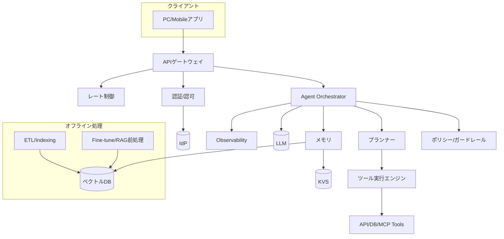

Mermaidサンプルコード

```mermaid
graph TD
    subgraph クライアント
    APP[PC/Mobileアプリ]
    end
    APP --> GW[APIゲートウェイ]
    GW --> ORCH[Agent Orchestrator]
    ORCH --> POL[ポリシー/ガードレール]
    ORCH --> PLAN[プランナー]
    PLAN --> EXEC[ツール実行エンジン]
    EXEC --> TOOLS[API/DB/MCP Tools]
    ORCH --> MEM[メモリ]
    MEM --> VDB[(ベクトルDB)]
    MEM --> KV[(KVS)]
    ORCH --> LLM[(LLM)]
    ORCH --> OBS[Observability]
    GW --> AUTH[認証/認可]
    AUTH --> IDP[(IdP)]
    GW --> RL[レート制御]
    subgraph オフライン処理
    ETL[ETL/Indexing] --> VDB
    TRAIN[Fine-tune/RAG前処理] --> VDB
    end
```

Markdownで表示されたときのイメージはこちら
https://gist.github.com/yokawasa/83559d96da5cb11e290fd1ead3800a3a